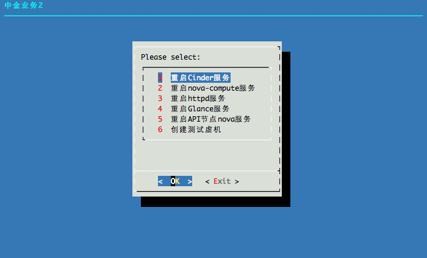

# OSOP

## Introduction

OSOP is short for OpenStack Operation toolkits.

## Installation

Install ansible.

```
pip install -U ansible

yum install ncurses
```

Install osop.

```
git clone https://github.com/tobegit3hub/osop.git

mv ./osop /root/

# Edit regionone_hosts and region
ls -s /root/osop/regionone /bin/
```

## Usage

Run commands with ncurses.

```
regiononej
```

Run commands in cluster or nodes.

```
ansible -i region_hosts api1 -m shell -a "ping -c 1 -W 1 127.0.0.1"
```

Run playbooks in cluster or nodes.

```
ansible-playbook -i region_hosts ping-local.yaml
```

## Screenshot



## Developer

* yifan <songyifan@unitedstack.com>
* tobe <tobeg3oogle@gmail.com>
